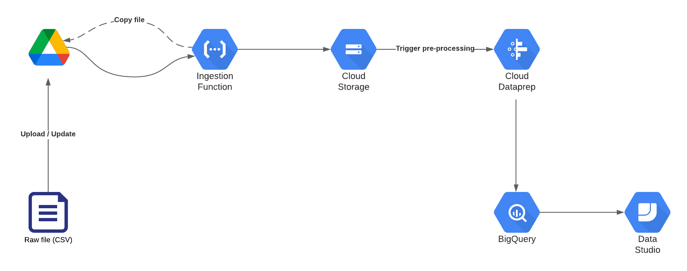

# Precis Digital case interview (Part One)

## Technical considerations
- Files in Google Drive are not necessarily going to be updated at the same time, so this pipeline needs to handle distinct processes for each file type.
- The pipeline should be idimpotent. I am _assuming_ when a file is "updated" - it simply has data appended to it. If these data contained in these files was actually replaced with an entirely new set of rows, the pipeline would need to be updated to account for that. This would simply be a matter of updating the BigQuery ingestion from a truncate to an append.

## Overview of pipeline

1) Google Drive push notifications are enabled on appropriate folder, and have been enabled via the drive API with a call to the 'watch' endpoint. This will send a notification to a notification channel any time a file is updated.

2) A cloud function (`copy_from_drive.py`) is deployed to receive these push notifications, and copy updated files to a landing bucket in cloud storage. They are copied with the current date as a prefix, as this will allow us to retain historical data for backfilling purposes.

3) When files land in Cloud Storage, a DataPrep flow is triggered to pre-process data and load it into BigQuery. There are three dataprep flows, one for each data type. 

4) (Not implemented) DBT (or similar tool) applying transformations on raw tables, in order to unlock and make the data more useable for customers.
 
---
## Technical tradeoffs and decisions
- Initially _Cloud Dataflow_ was to be used to handle preprocessing and ingestion of data into BigQuery - and the plan was to develop a single flexible process that would handle all three file/data types. I however decided against this, and went with DataPrep instead as I don't believe developing a completely resuable, flexible pipeline as a _first iteration_ of a solution is a good way to work. For me personally, I would rather see results quickly and with some compromise, than spend too much time developing the perfect solution.
- Instead of transforming the data during the processing stage - I decided to instead ingest all raw data into their respective tables in BigQuery, and then handle the transformations as a latter step (i.e ELT, not ETL). I believe that if a solution like this is to be used by analysts, then an ELT approach using an appropriate tool enables far greater visibility and transparency over data lineage.

--- 
### Further improvements and next steps (Theoretical)
- CI pipeline to automate deployment of solution. This might:
    1. Enable tracking of Drive folder via API
    2. Upload any helper/utility scripts to GCS
    3. Deploy infrastructure (Buckets, BQ tables, Cloud Functions)

---
#### Josh Lowe, 2021